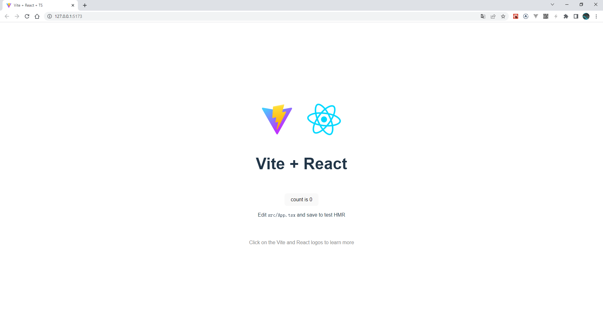
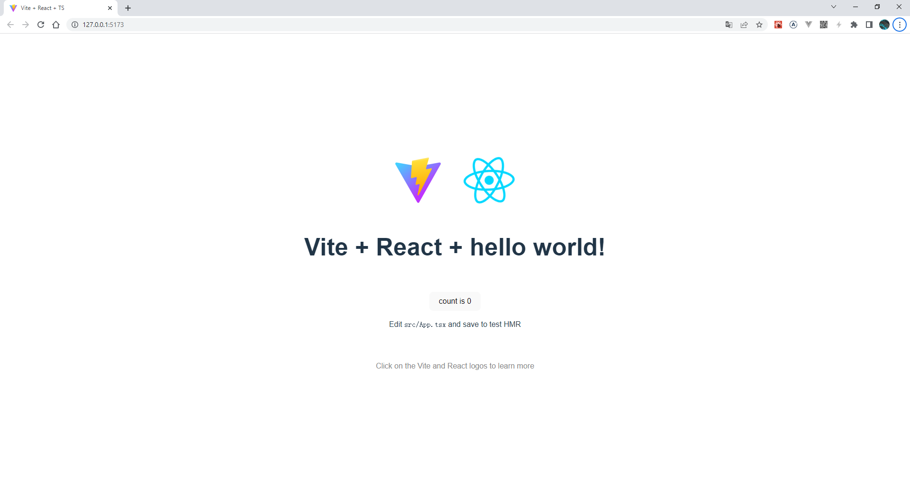
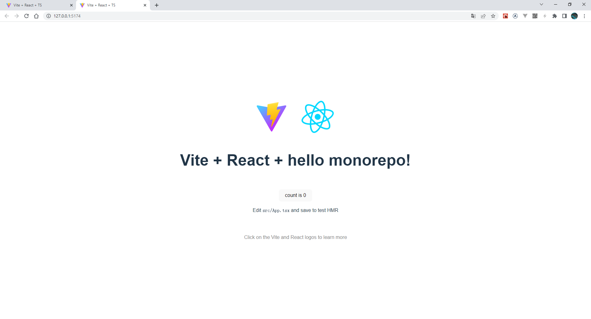
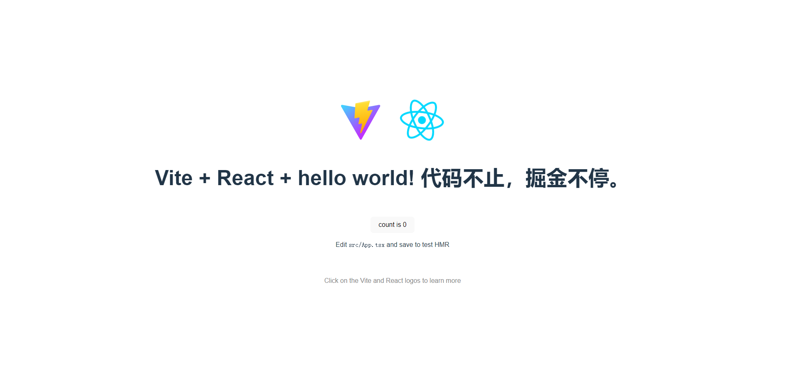
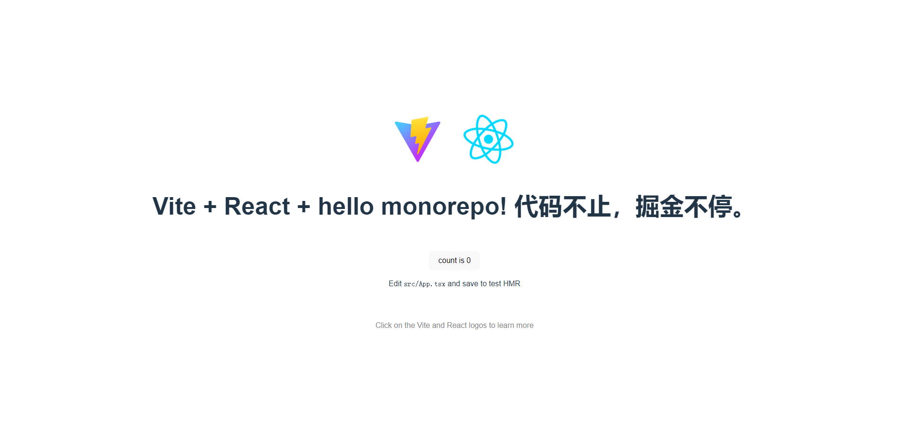
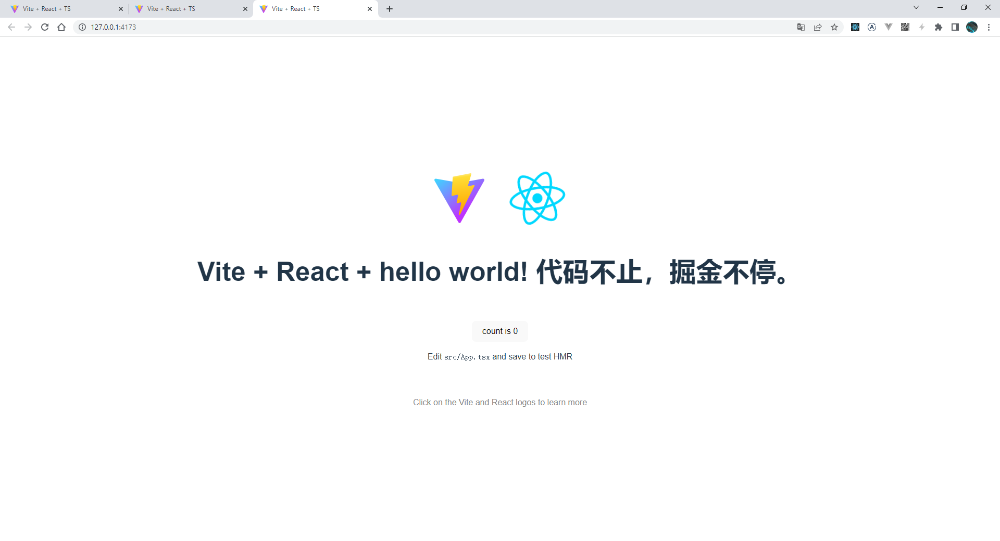

# 使用 `pnpm` 搭建 `monorepo` 项目

`pnpm` 是什么：

> Fast, disk space efficient package manager.
>
> 速度快、节省磁盘空间的软件包管理器


`monorepo` 是什么：

> A monorepo is a single repository containing multiple distinct projects, with well-defined relationships.
>
> monorepo 是包含多个不同项目的单个存储库，具有明确定义的关系。

为什么需要 `monorepo` ：
> 当你需要同时维护多个技术栈类似的项目，而这些项目之间互相依赖的时候，使用 `monorepo` 会有很多好处，比如：
- 项目基础设施可以统一管理，比如 `eslint`、`prettier`、`tsconfig`等
- 项目中抽离的公共代码库，在互相依赖的时候可以很方便的进行依赖管理和调试，比如 `utils`、`api`、`ui`等
- 以及使用 `npm`、`yarn`、`pnpm` 等包管理器可以方便的进行第三方依赖的统一管理，达到节省安装空间，提升安装速度等目的

`本文章只是记录项目搭建过程，并不做概念和原理的解释`

如果你对本文章感兴趣，又对标题中的 `pnpm` 和 `monorepo` 都不了解，可以在以下地址了解一下相关知识：

- [pnpm](https://pnpm.io/zh/)
- [monorepo](https://monorepo.tools)

## 准备工作

安装 `pnpm` , `node` 版本最好是在 `16v` 及以上

```sh
npm install -g pnpm
```

创建一个项目文件夹
```sh
mkdir monorepoo-project
cd monorepo-project
```

在项目中新建若干文件夹，搭建项目结构：
```lua
.
├─apps  # 应用代码目录
│  ├─admin  # 管理平台应用
│  └─portal # 门户网站应用
└─packages # 公共库
    ├─api # api管理
    ├─tsconfig # tsconfig配置
    ├─ui # 公共组件
    └─utils # 公共方法
```

在项目根目录新建文件 `pnpm-workspace.yaml`，写入如下代码：
```yaml
# pnpm-workspace.yaml

packages:
  - "packages/*"
  - "apps/*"
```

然后进行一些初始化工作，在下面根目录初始化生成 `package.json`
```sh
pnpm init
```

修改生成的 `package.json`
```json
// package.json
{
  "name": "monorepo-project",
  "version": "1.0.0",
  "scripts": {},
  "devDependencies": {}
}
```

基础的项目目录结构以及准备工作就完成了，接下来进行编码工作，去体验一下 `monorepo`

## 编写 demo 代码

### 编写 `utils` demo

在 `packages/utils` 初始化一下应用
```sh
cd ./packages/utils
pnpm init
```

修改 `packages/utils` 下生成的 `package.json`
```json
// packages/utils/package.json
{
  "name": "utils",
  "version": "0.0.0",
  "main": "./index.ts",
  "module": "./index.ts"
}
```

然后再新建一个文件 `index.ts`，写入一个测试方法
```js
function hello(msg = "world") {
  return `hello ${msg}!`;
}

export { hello };
```

### 编写 `portal` demo

这里使用 `vite` + `react` 技术栈，在 `apps/portal` 里初始化一下应用

在 `apps/portal` 初始化一下应用
```sh
cd ./apps/portal
pnpm create vite
```

如果在一个已经存在的文件夹下初始化 `vite` 应用，可以在 `Project name` 的时候输入 `.` ，这样就以已存在的文件夹作为应用目录

将 `apps/portal` 生成的 `package.json` 里的依赖配置剪切到根目录下的 `package.json`

```json
// apps/portal/package.json
{
  "name": "portal",
  "private": true,
  "version": "0.0.0",
  "type": "module",
  "scripts": {
    "dev": "vite",
    "build": "tsc && vite build",
    "preview": "vite preview"
  }
}
```

```json
// package.json
{
  "name": "monorepo-project",
  "version": "1.0.0",
  "scripts": {},
  "dependencies": {
    "react": "^18.2.0",
    "react-dom": "^18.2.0"
  },
  "devDependencies": {
    "@types/react": "^18.0.15",
    "@types/react-dom": "^18.0.6",
    "@vitejs/plugin-react": "^2.0.0",
    "typescript": "^4.6.4",
    "vite": "^3.0.0"
  }
}
```

然后安装一下依赖，这里安装在根目录的依赖是整个项目都可以直接使用的

```sh
pnpm install
```

> 如果要安装依赖到根目录，使用 `-w` 参数，比如：

```sh
pnpm add axios -w
```

> 如果要在指定的应用中安装依赖，使用 `--filter` 参数，比如：

```sh
pnpm --filter api add axios
```

> `--filter` 也可以指定在具体应用下执行脚本命令，比如：

启动 `portal` 应用

```sh
pnpm --filter portal dev
```


访问输出的 `Local Server` 地址 <http://127.0.0.1:5173>，如下图


接下来把刚才写的 `utils` 添加到 `portal` 中

```json
// apps/portal/package.json
{
  "name": "portal",
  "private": true,
  "version": "0.0.0",
  "type": "module",
  "scripts": {
    "dev": "vite",
    "build": "tsc && vite build",
    "preview": "vite preview"
  },
  "dependencies": {
    "utils": "workspace:*"
  }
}
```

这里的 `"utils": "workspace:*"` 是手动添加的，因为 `npm` 上是存在 `utils` 这个库的，
版本号写成 `workspace:*`，`workspace` 代表的是工作空间，这个在 [pnpm](https://pnpm.io/zh/) 里有介绍，
`*` 是代表使用最新版本版本，不过在本项目中也不存在依赖库版本变更问题。


然后在项目根目录下执行依赖安装

```sh
pnpm install
```

在 `portal` 中引入 `utils`，并使用我们编写的测试方法
```js
// apps/portal/src/App.tsx
+ import { hello } from "utils";
+ <h1>Vite + React + {hello()}</h1>
```

然后重新启动一下 `portal` 应用

```sh
pnpm --filter portal dev
```

再访问输出的 `Local Server` 地址 <http://127.0.0.1:5173>，如下图


### 编写 `admin` demo

按照 `portal` 应用的创建方式，创建一下 `admin` 应用，也引入 `utils` 进行测试， 然后启动 `admin`



在 `admin` 中引入 `utils`，并使用我们编写的测试方法
```js
// apps/admin/src/App.tsx
+ import { hello } from "utils";
+ <h1>Vite + React + {hello("monorepo")}</h1>
```

然后改一下 `utils` 提供的方法 `hello` 输出，再看一下 `portal` 和 `admin`
```js
// packages/utils/index.ts
+ return `hello ${msg}! 代码不止，掘金不停。`;
```

可以看到 `portal` 和 `admin` 不需要重启，`utils` 的修改就已经生效了，而且 `utils` 也不需要打包就可以引入使用




## 应用打包

然后我们再测试一下 `build`，然后使用 `vite` 提供的 `preview` 预览一下打包应用，运行以下命令

```sh
# 打包
pnpm --filter portal build
# 预览
pnpm --filter portal preview
```

通过 `preview` 命令输出的 `Local Server` 地址进行访问，正常会看到


最后，再按照上面的流程，编写一下 `ui` 和 `api` 的 demo 代码，
并应用到 `portal` 和 `admin` 中去。这部分代码我放到了github，
可以参考这个 [PR](https://github.com/yxb94616/monorepo-project/pull/1)